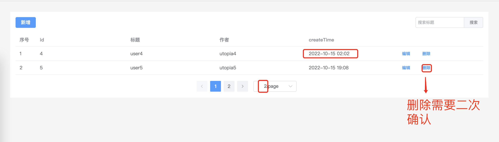
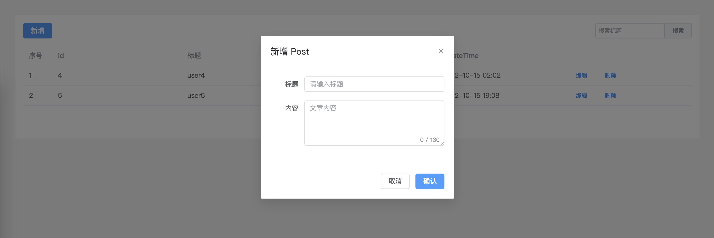

# 上机面试题

> 下面所有题目需要通过 `TypeScript` 完成

## 快速开始

请 `fork` 当前仓库再进去以下操作。

```bash
git clone https://github.com/**/interview-project

# !!! 要求通过 pnpm 安装依赖
pnpm install

# 开始开发
pnpm dev
```

## 已集成功能

* vite
* element-plus
* unocss
* vue-router
* axios
* dayjs (时间处理)

## 习题一





### 要求

* 参照图片当原型，完成表格显示、分页、搜索、新增、编辑、删除功能。

* 接口定义位于 `src/api/post.ts`， 请完善类型定义。

* 完善的 `TS` 类型定义、合理的组件拆分、语义化的代码。

* 接口定义位于 `src/api/post.ts`， 并完善类型定义（ 调用接口已由 `msw` mock）。

## 习题二

订单支付完成，我们需要查询订单状态是否结束；

例如，我们现在有这样一个接口 `queryOrder`

返回如下结果

1. { code: 1000, message: '成功'}
2. { code: -1000, message: '失败'}
3. { code: 1001, message: '未知'}


当我们请求到成功或者失败时，及时告诉用户，流程终止；

当我们请求到订单状态为未知的时候，我们需要继续请求该接口，轮询订单状态。轮询策略是：每次 **间隔3秒**；

最多轮询10次，如果第10次还是未知，告诉用户 状态为失败。

请完成这段逻辑


```javascript
queryOrder().then(res => {
  const { data } = res
  apiResult.value = data
  if (data.code === 1000) {
    // 订单成功
  } else if (data.code === -1000) {
    // 订单失败
  } else {
    // 未知状态，重新查询
  }
})
```

上面的代码以供参考示意，请完成此业务功能代码。
